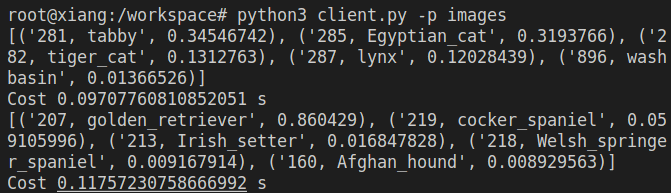

# Resnet-inference-service-using-websocket
We are using PyTorch ResNet18, converted to ONNX, to perform inference on images. The communication method being used is the WebSocket function.

## Getting Started

### Pre-requirements
Install **nvidia-driver-520**(gpu, cuda-11.8), **nvidia-docker** and **docker** before installing the docker container.

- [Tutorial-nvidia-driver](https://docs.nvidia.com/datacenter/tesla/tesla-installation-notes/index.html)

- [Tutorial-docker](https://docs.docker.com/engine/install/ubuntu/)

- [Tutorial-nvidia-docker](https://docs.nvidia.com/datacenter/cloud-native/container-toolkit/install-guide.html#docker)

- **Add docker to sudo group** 
    - [Tutourial](https://docs.docker.com/engine/install/linux-postinstall/)
    ``` 
    sudo groupadd docker
    sudo usermod -aG docker $USER
    sudo chmod 777 /var/run/docker.sock
    ```

### Building image
```shell
sudo chmod u+x ./docker/*.sh
sudo ./docker/build.sh
```

### Run docker container
```shell
sudo chmod u+x ./docker/*.sh
sudo ./docker/run.sh
```

### Run webAPI service

```shell
gunicorn -b 0.0.0.0:5000 --workers 4 --threads 100 webapi:app
```
- If you want to change port numbers, you shold change 0.0.0.0:**5000**.

### Testing
```python
python3 client.py -p <folder/files>
```
- p: The path of inference images. you can input the folder path or the image path.
<div align="center">
  
</div>

- If an error occurs with the WebSocket's **create_connection** function, you should do the following:
  ```shell
  pip uninstall websocket
  pip uninstall websocket-client
  pip install websocket
  pip install websocket-client
  ```

## Reference
- flask-sock
    - https://github.com/miguelgrinberg/flask-sock